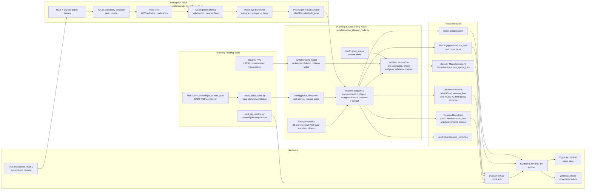
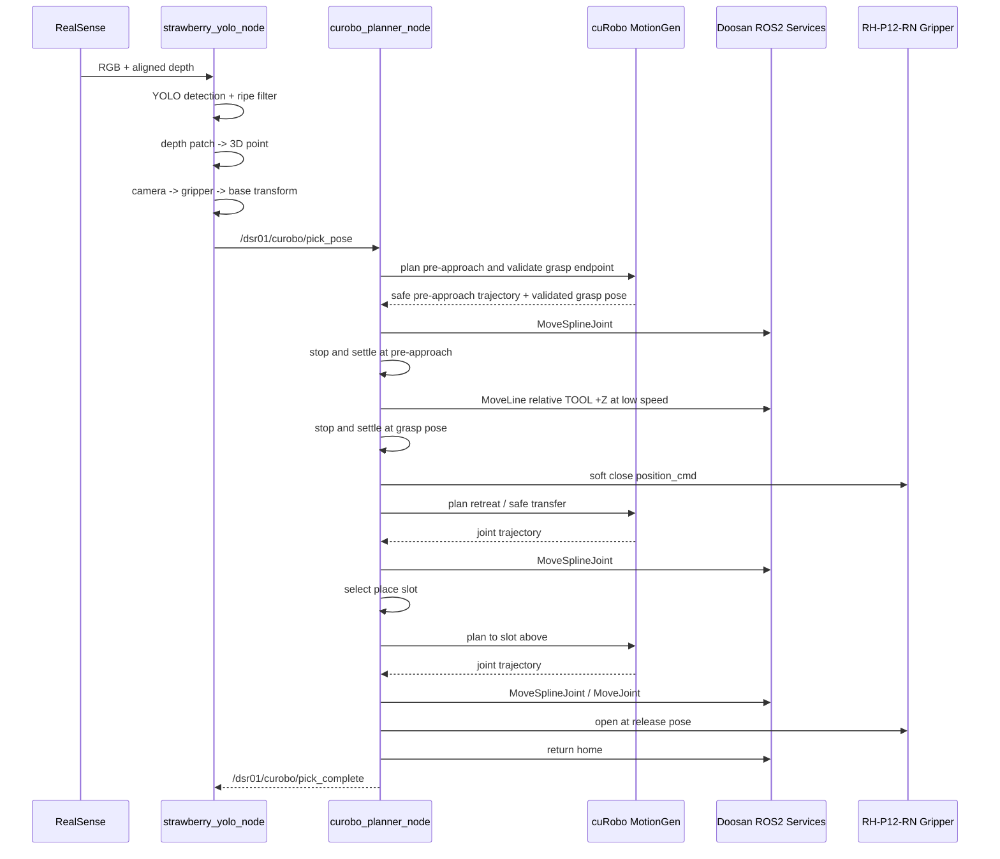

# RealSense + YOLO + cuRobo Strawberry Harvest System

## Runtime Pipeline

## Current Harvest Motion Notes

2026-06-07 기준 최종 파지 접근은 hybrid 방식이다.

- cuRobo는 pre-approach 경로와 grasp endpoint의 IK/collision/branch 안전성을 검증한다.
- 실제 마지막 진입은 pre-approach에서 완전히 멈춘 뒤 Doosan `MoveLine`으로
  TOOL `+Z` 방향 저속 직선 이동한다.
- 현재 SW 실기에서 수평 정면 진입 방향은 확인했지만, 최종 진입 깊이가 부족해
  실제 줄기 파지는 아직 성공하지 못했다.
- `grasp OK`와 `pick_complete`는 실제 파지 성공을 의미하지 않는다.

상세 기록: [harvest_motion_session_20260607.md](harvest_motion_session_20260607.md)
