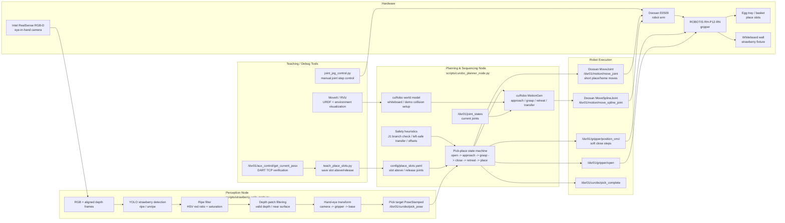
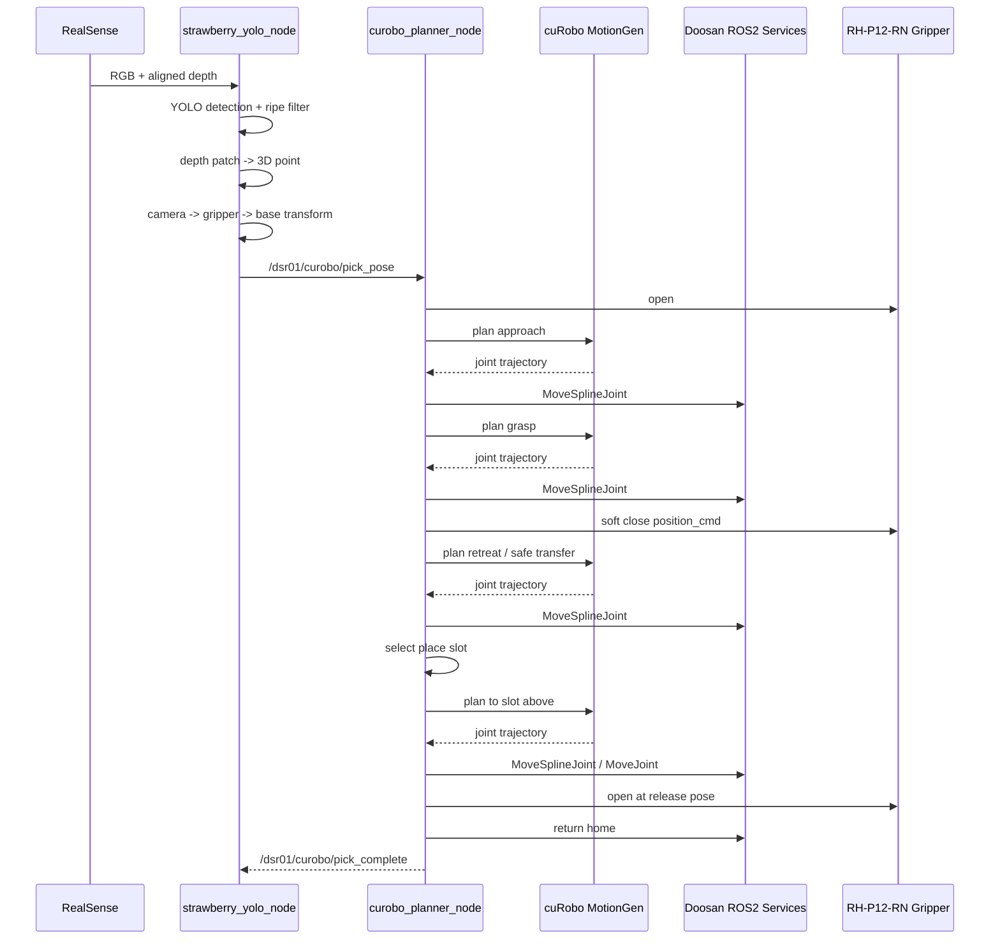

# RealSense + YOLO + cuRobo Strawberry Harvest System

```mermaid
flowchart LR
    subgraph HW["Hardware"]
        CAM["Intel RealSense RGB-D<br/>eye-in-hand camera"]
        ROBOT["Doosan E0509<br/>robot arm"]
        GRIPPER["ROBOTIS RH-P12-RN<br/>gripper"]
        TRAY["Egg tray / basket<br/>place slots"]
        BOARD["Whiteboard wall<br/>strawberry fixture"]
    end

    subgraph PERCEPTION["Perception Node<br/>scripts/strawberry_yolo_node.py"]
        RGBD["RGB + aligned depth frames"]
        YOLO["YOLO strawberry detection<br/>ripe / unripe"]
        FILTER["Ripe filter<br/>HSV red ratio + saturation"]
        DEPTH["Depth patch filtering<br/>valid depth / near surface"]
        TF["Hand-eye transform<br/>camera -> gripper -> base"]
        TARGET["Pick target PoseStamped<br/>/dsr01/curobo/pick_pose"]
    end

    subgraph PLANNING["Planning & Sequencing Node<br/>scripts/curobo_planner_node.py"]
        STATE["/dsr01/joint_states<br/>current joints"]
        WORLD["cuRobo world model<br/>whiteboard / demo collision setup"]
        CUROBO["cuRobo MotionGen<br/>approach / grasp / retreat / transfer"]
        SEQ["Pick-place state machine<br/>open -> approach -> grasp -> close -> retreat -> place"]
        SLOTS["config/place_slots.yaml<br/>slot above / release joints"]
        SAFETY["Safety heuristics<br/>J1 branch check / left-safe transfer / offsets"]
    end

    subgraph EXEC["Robot Execution"]
        SPLINE["Doosan MoveSplineJoint<br/>/dsr01/motion/move_spline_joint"]
        MOVEJ["Doosan MoveJoint<br/>/dsr01/motion/move_joint<br/>short place/home moves"]
        OPEN["/dsr01/gripper/open"]
        POSCMD["/dsr01/gripper/position_cmd<br/>soft close steps"]
        DONE["/dsr01/curobo/pick_complete"]
    end

    subgraph TOOLS["Teaching / Debug Tools"]
        TEACH["teach_place_slots.py<br/>save slot above/release"]
        JOG["joint_jog_control.py<br/>manual joint step control"]
        TCP["/dsr01/aux_control/get_current_posx<br/>DART TCP verification"]
        RVIZ["MoveIt / RViz<br/>URDF + environment visualization"]
    end

    CAM --> RGBD
    RGBD --> YOLO
    YOLO --> FILTER
    FILTER --> DEPTH
    DEPTH --> TF
    TF --> TARGET

    TARGET --> SEQ
    STATE --> CUROBO
    WORLD --> CUROBO
    SLOTS --> SEQ
    SAFETY --> SEQ
    SEQ --> CUROBO
    CUROBO --> SPLINE
    SEQ --> MOVEJ
    SEQ --> OPEN
    SEQ --> POSCMD
    SEQ --> DONE

    SPLINE --> ROBOT
    MOVEJ --> ROBOT
    OPEN --> GRIPPER
    POSCMD --> GRIPPER
    ROBOT --> GRIPPER
    GRIPPER --> BOARD
    GRIPPER --> TRAY

    TEACH --> SLOTS
    JOG --> ROBOT
    TCP --> TEACH
    RVIZ --> WORLD
```

## Runtime Pipeline

```mermaid
sequenceDiagram
    participant Camera as RealSense
    participant Vision as strawberry_yolo_node
    participant Planner as curobo_planner_node
    participant CuRobo as cuRobo MotionGen
    participant Doosan as Doosan ROS2 Services
    participant Gripper as RH-P12-RN Gripper

    Camera->>Vision: RGB + aligned depth
    Vision->>Vision: YOLO detection + ripe filter
    Vision->>Vision: depth patch -> 3D point
    Vision->>Vision: camera -> gripper -> base transform
    Vision->>Planner: /dsr01/curobo/pick_pose

    Planner->>Gripper: open
    Planner->>CuRobo: plan approach
    CuRobo-->>Planner: joint trajectory
    Planner->>Doosan: MoveSplineJoint

    Planner->>CuRobo: plan grasp
    CuRobo-->>Planner: joint trajectory
    Planner->>Doosan: MoveSplineJoint
    Planner->>Gripper: soft close position_cmd

    Planner->>CuRobo: plan retreat / safe transfer
    CuRobo-->>Planner: joint trajectory
    Planner->>Doosan: MoveSplineJoint

    Planner->>Planner: select place slot
    Planner->>CuRobo: plan to slot above
    CuRobo-->>Planner: joint trajectory
    Planner->>Doosan: MoveSplineJoint / MoveJoint
    Planner->>Gripper: open at release pose
    Planner->>Doosan: return home
    Planner-->>Vision: /dsr01/curobo/pick_complete
```
